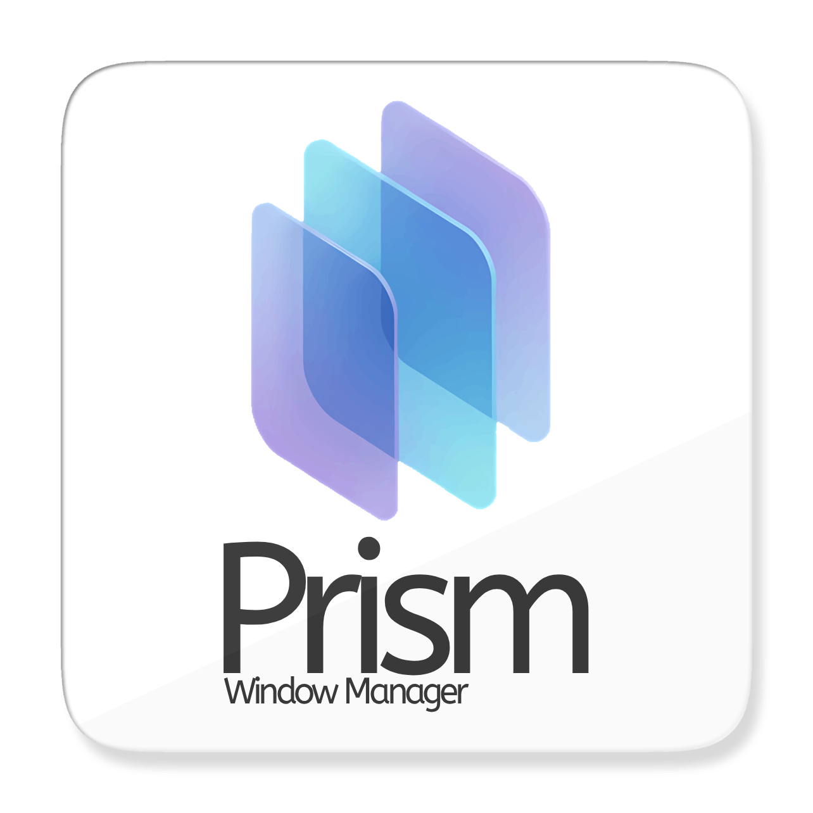

<p align="center">
  
</p>

<p align="center">
  <code>@prism-wm</code>
</p>

A desktop windowing system for the browser: draggable, resizable windows with focus and z-index handling, minimize and maximize, edge snapping, dialogs, and a RAM manager that unloads the bodies of long-minimized windows.

It works with Vue 3, React and Svelte. The windowing logic lives once in a vanilla-TypeScript core; each adapter is a thin rendering layer over it.

Extracted from [HomeDock OS](https://github.com/BansheeTech/HomeDockOS), which is what it is tested against.

## Packages

| Package                                                              | Version                                                                                                                  | What it is                                                                                                                     |
| -------------------------------------------------------------------- | ------------------------------------------------------------------------------------------------------------------------ | ------------------------------------------------------------------------------------------------------------------------------ |
| [`@prism-wm/core`](https://www.npmjs.com/package/@prism-wm/core)     | [](https://www.npmjs.com/package/@prism-wm/core)       | Store, geometry and RAM manager. No DOM, no framework.                                                                         |
| [`@prism-wm/styles`](https://www.npmjs.com/package/@prism-wm/styles) | [](https://www.npmjs.com/package/@prism-wm/styles)   | `prism-structure.css` (layout and motion) and `prism-theme.css` (colour, via `--pwm-*` custom properties). Import one or both. |
| [`@prism-wm/vue`](https://www.npmjs.com/package/@prism-wm/vue)       | [](https://www.npmjs.com/package/@prism-wm/vue)         | Vue 3 adapter.                                                                                                                 |
| [`@prism-wm/react`](https://www.npmjs.com/package/@prism-wm/react)   | [](https://www.npmjs.com/package/@prism-wm/react)     | React adapter.                                                                                                                 |
| [`@prism-wm/svelte`](https://www.npmjs.com/package/@prism-wm/svelte) | [](https://www.npmjs.com/package/@prism-wm/svelte)   | Svelte adapter.                                                                                                                |

## Install

Pick the adapter for your framework; it brings `@prism-wm/core` and `@prism-wm/styles` with it.

```bash
npm install @prism-wm/vue      # or @prism-wm/react, @prism-wm/svelte
```

## Developing

```bash
pnpm install
pnpm build
pnpm test        # 276 tests
pnpm typecheck
```

The three apps under `examples/` run the same demo on each framework.

## Using it

Mount the manager once, tell it how to turn an app id into a component, and open windows by id:

```vue
<PrismWindowManager :store="store" :resolveComponent="resolveComponent" />
```

```ts
import { createWindowManager } from "@prism-wm/vue";

const store = createWindowManager({
  resolveApp: (appId) => APPS[appId],
});

store.openWindow("notepad", { title: "Untitled" });
```

Windows are addressed by id because they are opened from places that know nothing about each other: a taskbar, a start menu, a desktop icon for something installed after the code shipped.

Dialogs are the opposite case, so they are written where they are used:

```vue
<PrismDialog v-model:visible="confirming" title="Delete file?" ok-text="Delete" @ok="del">
  <p>{{ file.name }} will be permanently removed.</p>
</PrismDialog>
```

The content stays in the parent's template and in its scope. A dialog is still a window underneath, so it drags, stacks and animates like everything else; it just cannot be resized or minimized, opens centred, and can block what is behind it.

### Two ways to style it

Import `prism-theme.css` for a working look out of the box, and override the `--pwm-*` custom properties to taste.

Hosts that already own a design system can skip it and pass their own class names through the `classes` prop instead, keeping only `prism-structure.css` for geometry and motion. That is what HomeDock OS does, painting the chrome with Tailwind.

### Appearance

`appearance` controls where the window controls sit: `"redmond"` puts them on the right in minimize/maximize/close order, `"cupertino"` on the left in close/minimize/zoom order with a centred title.

## Notes

- A closing window stays in the list, flagged `isClosing`, until its exit animation ends. A dialog stays in the list too, flagged `kind: "dialog"`. Anything building UI from that list, a taskbar or an alt-tab, wants to filter both out.
- `requestClose` runs the host's `onBeforeClose` veto and animates. `closeWindow` is the immediate, unconditional removal.
- Vite 8 users: the CSS is plain enough that lightningcss handles it, but the `@media (prefers-reduced-motion)` blocks must survive minification.

## License

AGPL-3.0-or-later. Anyone who conveys Prism or a work derived from it, including over a network, has to release the corresponding source of that work under the
AGPL. Splitting the changes into a separate adapter file does not avoid this: copyleft covers the derivative work as a whole.

### If you deploy this in a web app

The AGPL's section 13 goes further than the GPL: if your program lets users interact with it over a network, you have to offer those users the source of _your_ program, not just of Prism. In practice that means a visible link to your source from the running application.

This catches people out, because nothing in `npm install` warns you about it. If that does not suit your project, the commercial license below does.

A commercial license is available for parties who cannot comply with the AGPL.

Banshee Technologies S.L. holds the copyright in Prism-wm and can therefore dual-license it.

Contact us through [Banshee Technologies S.L.](https://www.banshee.pro) or at hello@banshee.pro.
